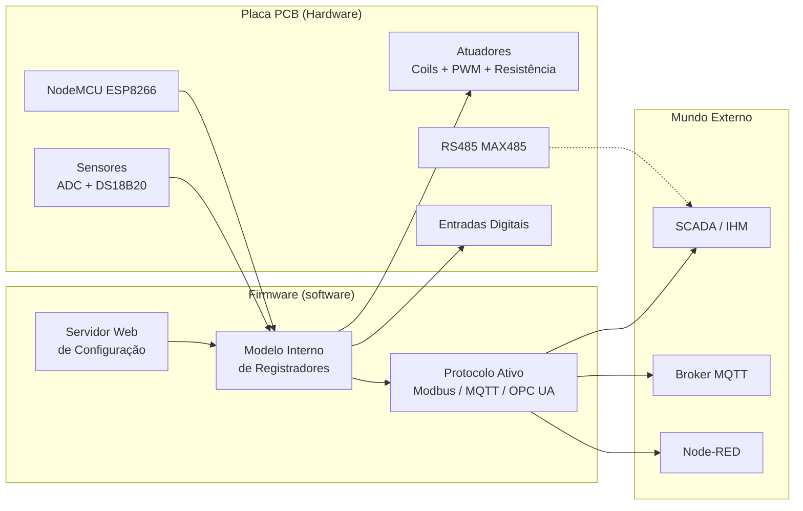
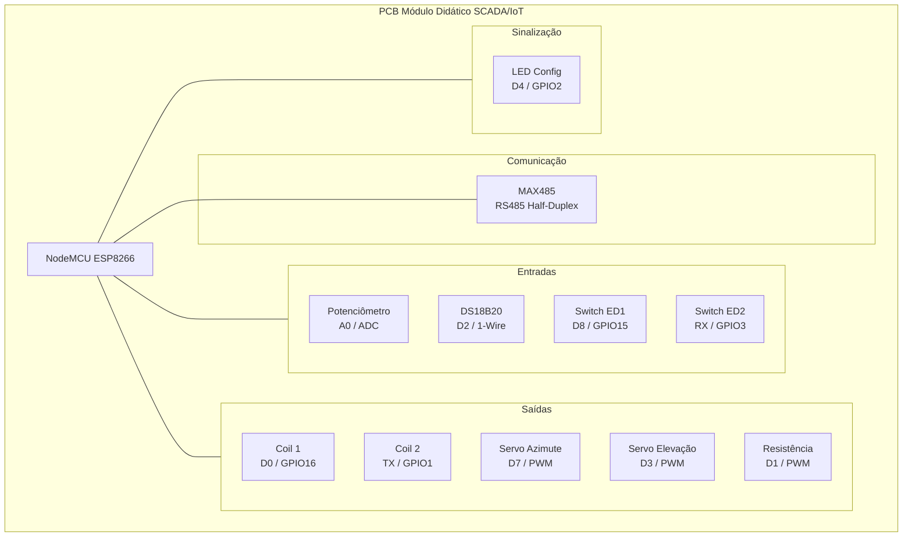

# Projeto: PCB Módulo Didático SCADA/IoT

## Descrição do Projeto
Este projeto tem como objetivo fornecer uma plataforma de aprendizado para estudantes e entusiastas de automação industrial, sistemas SCADA e Internet das Coisas (IoT). A placa de circuito impresso (PCB) foi projetada para ser utilizada em laboratórios educacionais, permitindo a prática de conceitos teóricos em um ambiente controlado.

A PCB integra um **NodeMCU v2 (ESP8266)** com os seguintes componentes onboard:

- **Potenciômetro** — sinal analógico variável (simula sensor analógico)
- **Sensor DS18B20** — temperatura digital via 1-Wire
- **Driver de potência (transistor/resistência de aquecimento)** — carga controlada por PWM
- **Driver para servomotores** — canais PWM para azimute e elevação
- **Interface RS485 (MAX485)** — comunicação serial industrial half-duplex
- **Conectores para coils** — saídas digitais para relés ou buzzer
- **Conectores para entradas digitais** — contato seco ou switch onboard
- **LEDs de sinalização** — indicação visual de estado

---

> 🧩 **Projeto do firmware:** Este projeto foi desenvolvido para o firmware disponível em [github.com/wvianna/pcb-moduloDidatico-SCADA-IoT-firmware](https://github.com/wvianna/pcb-moduloDidatico-SCADA-IoT-firmware). O firmware gerencia todos os I/Os, sensores e interface RS485, implementando comunicação via **Modbus TCP/RTU**, **MQTT** e **OPC UA PubSub** — com seleção de protocolo via interface web.

---

**Autor:** William da Silva Vianna  
**Software Utilizado:** KiCad (v9 ou superior)

---

## 🧠 Visão Geral da Arquitetura



---

## 📋 Mapeamento de I/Os Físicos

A tabela abaixo relaciona cada funcionalidade da PCB ao pino do NodeMCU e ao registro Modbus correspondente. Este mapeamento é idêntico para todos os protocolos (Modbus, MQTT e OPC UA).

### Saídas Discretas (Coils)

| Endereço Modbus | Função | Pino NodeMCU | GPIO | Componente na PCB |
| ---: | --- | --- | --- | --- |
| 00001 | Saída discreta 1 | D0 | GPIO16 | Conector para relé/buzzer |
| 00002 | Saída discreta 2 | TX | GPIO1 | Conector para relé/buzzer |

### Entradas Discretas (Discrete Inputs)

| Endereço Modbus | Função | Pino NodeMCU | GPIO | Componente na PCB |
| ---: | --- | --- | --- | --- |
| 10001 | Entrada discreta 1 | D8 | GPIO15 | Switch onboard ou contato seco externo |
| 10002 | Entrada discreta 2 | RX | GPIO3 | Switch onboard ou contato seco externo |

> **Nota:** A entrada discreta 1 (ED1 / D8) também funciona como *boot pin* para forçar o modo de setup — basta colocá-la em nível baixo e reiniciar a placa.

### Entradas Analógicas (Input Registers)

| Endereço Modbus | Função | Pino NodeMCU | Faixa | Componente na PCB |
| ---: | --- | --- | ---: | --- |
| 30001 | ADC (potenciômetro) | A0 | 0..1023 | Potenciômetro onboard |
| 30002 | DS18B20 (temperatura) | D2 / GPIO4 | 0..1250 (x10 °C) | Sensor DS18B20 onboard |

### Saídas PWM (Holding Registers)

| Endereço Modbus | Função | Pino NodeMCU | GPIO | Faixa | Componente na PCB |
| ---: | --- | --- | --- | ---: | --- |
| 40001 | PWM azimute | D7 | GPIO13 | 0..1023 | Driver para servomotor |
| 40002 | PWM elevação | D3 | GPIO0 | 0..1023 | Driver para servomotor |
| 40003 | PWM resistência de aquecimento | D1 | GPIO5 | 0..1023 | Transistor + resistor de aquecimento onboard |

### Interface RS485 (Modbus RTU)

| Sinal MAX485 | Pino NodeMCU | GPIO |
| --- | --- | --- |
| RO (receptor) | D5 | GPIO14 |
| DI (driver) | D6 | GPIO12 |
| DE + RE (direção) | D4 | GPIO2 |

---

## 🔌 Diagrama de Blocos da PCB



---

## ⚡ Especificações Elétricas

| Parâmetro | Valor |
| --- | --- |
| Alimentação da placa | 5V DC (via USB ou conector) |
| Regulador onboard | 3,3V para o NodeMCU |
| Nível lógico dos GPIOs | 3,3V |
| Corrente máxima por GPIO | ~12 mA (com resistor de limitação) |
| Tensão no barramento RS485 | Diferencial (A/B) |
| Temperatura do DS18B20 | -55°C a +125°C |
| Faixa do ADC | 0..3,3V (10 bits, 0..1023) |

---

## 💻 Necessidade de Firmware

> ⚠️ **Nota Importante:** Este hardware **não é puramente analógico**. A placa foi projetada ao redor de uma arquitetura programável — o circuito impresso isolado não desempenha nenhuma função sem o respectivo **firmware**.

O firmware disponível em [pcb-moduloDidatico-SCADA-IoT-firmware](https://github.com/wvianna/pcb-moduloDidatico-SCADA-IoT-firmware) implementa:

1. **Inicialização (Setup):** Configuração dos registradores, direção dos pinos de I/O e taxas de transmissão dos barramentos.
2. **Loop principal cooperativo:** Leitura cíclica de sensores, atualização do modelo interno de registradores e aplicação nas saídas físicas — sem uso de `delay()` bloqueante.
3. **Servidor web de configuração:** Interface para definir SSID, IP, protocolo ativo (Modbus/MQTT/OPC UA) e parâmetros de comunicação, acessível via modo AP.
4. **Pilhas de comunicação:** Modbus TCP (porta 502), Modbus RTU (RS485), MQTT (PubSubClient) e OPC UA PubSub sobre MQTT.
5. **Persistência em LittleFS:** Configuração salva em arquivo texto na flash, com validação e fallback para valores padrão.

---

## 📁 Estrutura de Arquivos no Repositório

```text
├── esquema.pdf             # Diagrama esquemático exportado para leitura
├── meu-projeto.kicad_pro   # Arquivo de gerenciamento do projeto KiCad
├── meu-projeto.kicad_sch   # Folha do desenho esquemático
├── meu-projeto.kicad_pcb   # Layout da placa de circuito impresso
├── docs/
│   ├── mapeamentopinosmb.txt  # Mapa de pinos em formato CSV
│   └── requisitos.txt         # Requisitos elétricos e funcionais
├── firmware/                  # Submódulo do firmware
└── .gitignore              # Filtro de arquivos temporários do KiCad
```

---

## 🔗 Links Relacionados

| Recurso | Link |
| --- | --- |
| Repositório do firmware | [github.com/wvianna/pcb-moduloDidatico-SCADA-IoT-firmware](https://github.com/wvianna/pcb-moduloDidatico-SCADA-IoT-firmware) |
| Documentação do firmware | README do firmware |
| Esquema elétrico | `esquema.pdf` neste repositório |
| Mapa de pinos (CSV) | `docs/mapeamentopinosmb.txt` |